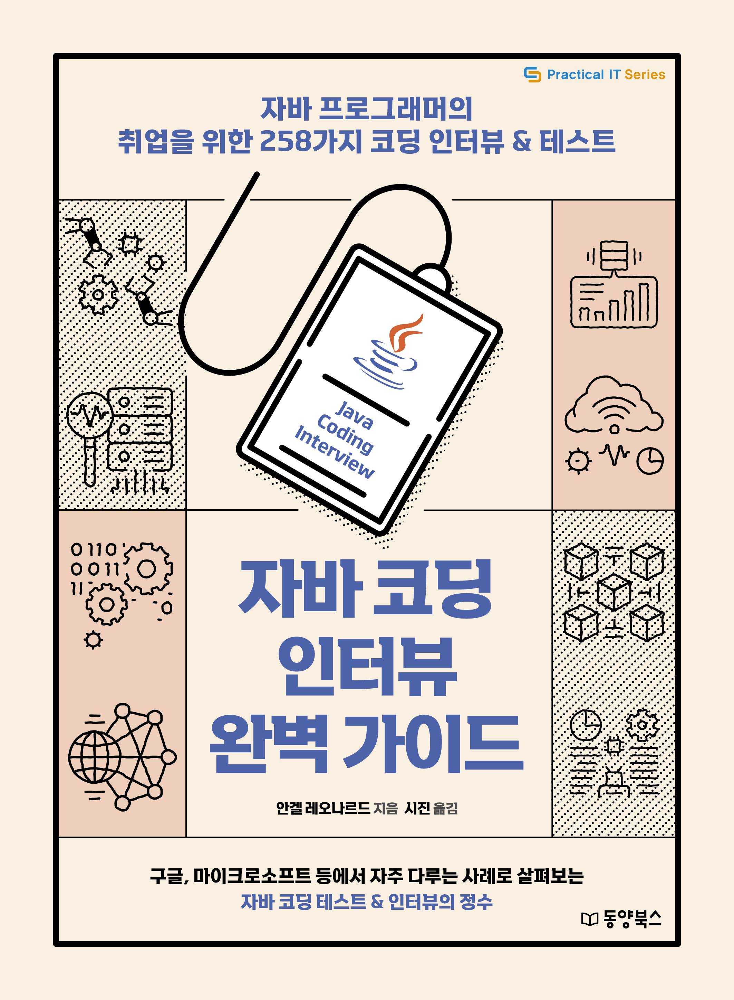

# 『자바 코딩 인터뷰 완벽 가이드』

동양북스 『자바 코딩 인터뷰 완벽 가이드』의 깃허브 저장소입니다.

## 예제 파일 다운로드
저장소를 클론하지 않을 분은 [이곳](https://bit.ly/3OPfRhi)을 눌러서 예제 파일을 다운로드하세요.

## 구매하기
[교보문고](https://bit.ly/3ddzVNj) | [알라딘](https://bit.ly/3A3Konm) | [YES24](https://bit.ly/3A3FXsB) | [인터파크](https://bit.ly/3bG7N51)

## 책 소개

**코딩 인터뷰뿐만 아니라 연봉 협상법, 불합격 대처법까지!**  
**자바 프로그래머의 취업 & 이직 노하우 대공개**

자바는 전자정부 표준프레임워크를 이용하는 웹 기반 애플리케이션 개발부터 안드로이드 앱 같은 모바일 분야까지 다양한 산업을 지탱하는 매우 인기 있는 프로그래밍 언어입니다. 전 세계 수십억 대의 장치에 사용되기 때문에 많은 사람이 배우고 싶어 하는 매력적인 언어이기도 합니다. 또한 컴퓨터공학 전공이라면 객체지향 프로그래밍을 제대로 이해하는 데 꼭 필요한 핵심이기도 합니다. 이러한 자바를 배우는 것과 자바 분야에서 경력을 쌓는 것에는 큰 차이가 있습니다.

이 책은 자바 관련 경력을 쌓고 자바 중심 기술 인터뷰를 멋지게 해내고 싶은 독자에게 필요한 가이드입니다. 구글, 아마존, 마이크로소프트, 어도비, 플립카트와 같은 다양한 IT 기업에 입사 지원했을 때 마주할 수 있는 250개 이상의 가장 유명한 자바 코딩 테스트&인터뷰 문제를 독창적인 방식으로 해결합니다. 이를 위해 광범위한 자바 코딩 인터뷰&테스트를 해결하는 최고의 기법을 모았습니다.

이 책을 다 읽고 나면 여러분은 자바 코딩 테스트나 인터뷰 문제를 해결하기 위한 탄탄한 정보 기반을 갖추게 될 것입니다. 또한 여러분이 꿈꾸는 자바 프로그래머가 될 수 있다는 자신감을 심어줄 것입니다.

## 기타 사항
정오표는 [이곳](./readme/errata/errata.md)을 참고하기 바랍니다.